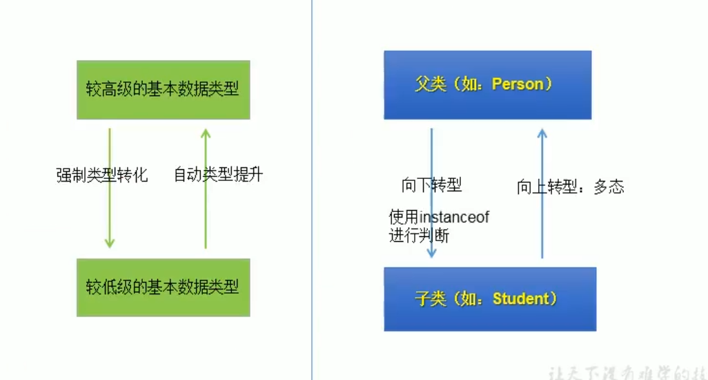
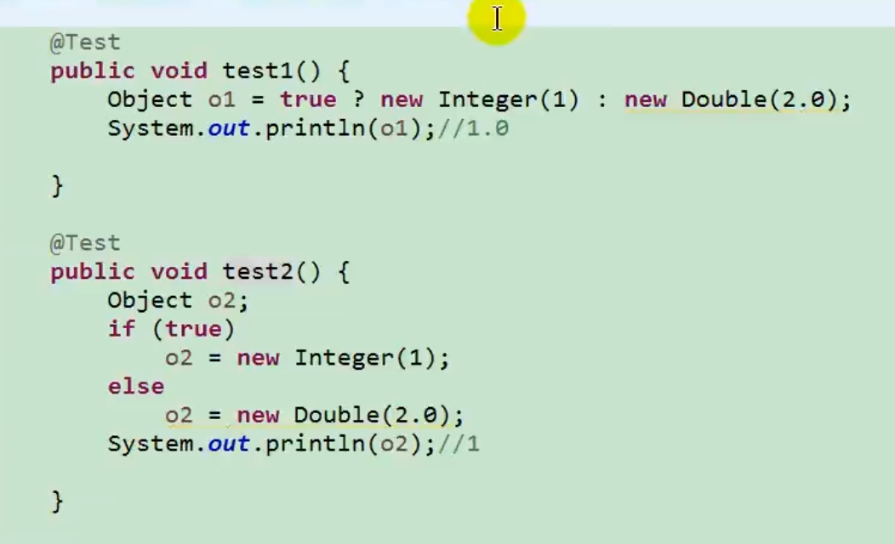
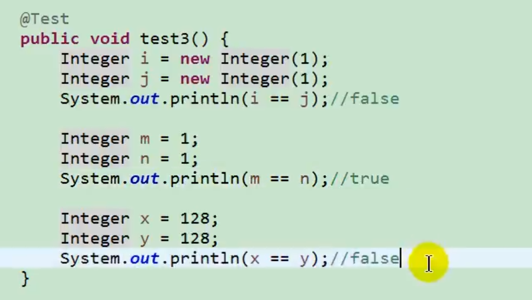
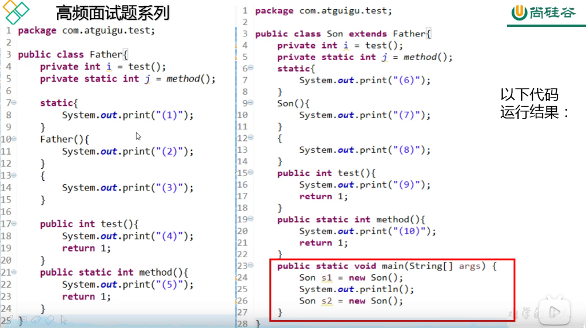
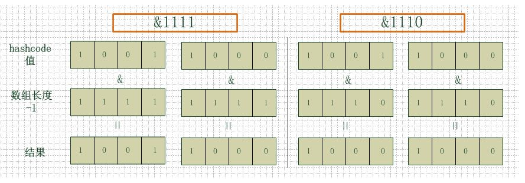
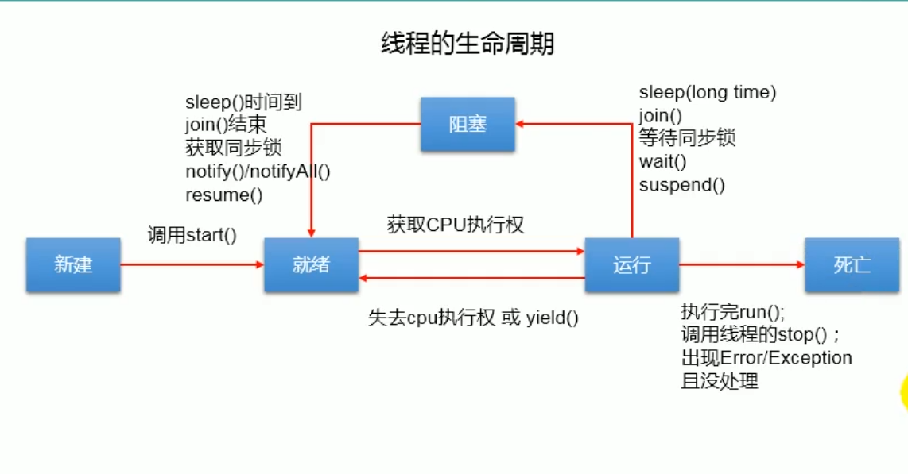
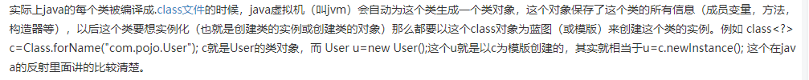

# Java知识点合集

#### 权限修饰符的作用域

- private:    只有该类可以访问
- protected:  该类，该类的子类，同一个包下的所有类均可以访问
- public :    所有类都可以访问

如果没有修饰符，则只有本类和同一个包下的类可以访问。(继承了该类的不在一个包中的子类不能访问)

#### 类和对象

- 类：对一类事物的描述，是抽象概念
- 对象：实际存在的某类事务的个体，也称为实例

#### 匿名对象

在生成对象的时候不显示的赋值给一个变量。

```java
new Tset().printInfo();  
```

#### 方法的重载(overload)和重写(override)

- 重载：同一个类中可以有多个同名函数，但是要求他们的参数个数或者类型不同。子类可以重载父类的方法。
- 重写：继承了某个类的子类可以将父类的方法重写，实现不同的功能。重写注意事项如下：

1) 重写要求方法名和形参列表都一致。
2) 子类重写的方法的权限修饰符不小于父类被重写方法的权限修饰符。父类中的private方法不能被子类重写。
3) 父类返回值类型是void,子类也只能是void;父类返回值类型是A类，则子类的返回值类型是A类或A类的子类; 父类的返回值类型是基本数据类型，则子类的返回值类型必须和父类一致。
4) 子类重写的方法抛出的异常类型不大于父类被重写方法抛出的异常类型。

#### 方法中可变个数的形参

可以匹配0到多个参数,若参数列表中还有其他的参数，则可变个数形参应放在最后。若函数体中需要调用可变个数形参，则使用方式跟数组类似。如下所示。

```java
void show(String ... name){         //形式： 参数类型 ... 参数名
    for(int i=0; i<name.length; i++>){
        System.out.print(name[i]);
    }
}    
```

注意，这种方法和直接传递数组被java认为是相同的，所以只能存在一个。一个方法中最多只有一个可变个数形参。

```java
void show(String[] names]){}    
```

#### java面向对象三大特性

- 封装性：屏蔽方法的实现细节，对用户提供方法接口。使代码更加简洁，结构更加清晰。
- 继承：将多个相同的属性和方法提取出来包装成类，继承了该父类的子类可以继承父类的属性和方法，但用privte标识的属性不能直接访问。为多态的使用提供前提。java只支持单继承和多重继承，不能多继承。
- 多态：一个事务的多种形态。对象的多态性：父类的引用指向子类的对象。如

```java
Person p=new Man();     //Man是继承了Person类的子类
```

<font color=red>为什么要有多态？
这样可以在不改变代码的情况下，根据运行时绑定的对象不同来运行不同的代码。
</font>

多态性的使用：<font color=red>虚拟方法调用(父类中的方法称为虚拟方法， 或者虚方法)</font>
在编译期，只能调用父类中声明的方法。在运行期，使用子类中重写的方法。也成为动态绑定。但是这个要求只适用于方法，不适用于对象的属性，属性不存在多态性。

多态性的使用前提：①要有继承关系 ②要有方法的重写

```java
System.out.print(p.id);
p.eat();
```

程序输出为：1001， 男人吃饭，前者是Person中的属性，后者是Man中重写的方法。

在对象的多态性中，只能访问父类中声明的属性和方法，如果我想访问其子类的方法应该怎么办？
答： 向下转型，使用强制类型转换。

```java
Man man=(Man)p;
```



使用强制类型转换时，可以会出现ClassCastExcpetion异常，也就是说，父类一开始是用Man类来实例化的，当想把父类强转成Woman类时就会出错。在强转时可以先用instanceof来进行判断。

- instanceof使用方法：a instaceof A: 判断对象a是不是类A的实例，如果是就返回true,否则返回false;

```java
if(p instanceof Man){
    Man m1=(Man)p;
}
```

若a instaceof A返回true,则a instaceof B也返回true，其中B是A的父类。

```java
if(p instanceof Man){
    Man m1=(Man)p;
}
if(p instanceof Person){
    //可以进入
}
if(p instanceof Object){
    //可以进入
}
```

#### int和Integer的区别与联系

int是基本数据类型，Integer是把int类型进行封装后形成的类。为了让基本数据类型也有类的特征和功能，所以对基本数据类型也进行了封装。

#### 面试题考点

1、以下代码的输出各是多少？



答： test1输出1.0，test2输出1。在 1 ? a: b;这样的三目运算符中，要求后面两个条件是同样的类型，这里自动将Integer类型提升成了Double类型，所以结果是1.0。

2、以下代码的输出各是多少？


答： false,true,false;第一个很明显false。第二第三个的结果跟Integer类中的一个内部类有关。Java为了提高装箱效率，把最常使用的数据用一个数组缓存起来，如果赋值的数据在此范围内，则直接返回对应的包装类。否则额外生成。这个数据的范围是(-128~127),是研究发现最常使用的数据范围，所以m==n为true,x和y超过了该数据范围，都需要重新生成对象，所以为false。

#### static关键字

用static 修饰的属性称为静态变量，如果我们创建了一个类的多个实例，每个实例共享这一个静态变量，当其中一个实例对静态变量进行了修改，则其他实例对应的该属性也跟着改变。

- 静态变量的加载随着类的加载而加载，可以通类.静态变量的方式来访问
- 静态变量早于对象的创建
- 由于类只会加载一次，则静态变量在内存中只存在一份，放在方法区中的静态域中。

用static修饰的方法称为静态方法，具有上述的性质，通过类.方法的方式调用。注意，在静态方法中不能使用this,super关键字，这两个关键字也是基于某个具体的对象的。

<font color=red>静态方法中可以调用非静态方法吗？</font>
答： 不行，静态方法中只能调用静态属性和方法。非静态方法中可以调用静态和非静态的属性或方法。这是因为，静态方法可以通过类.方法名的方式访问，而非静态方法需要实例化后才能访问。

开发中，如果确定属性和方法是否应该是静态的？
答：如果一个属性可以被多个用户共享，那么该属性可以声明成静态的。操作静态属性的方法应该声明为静态方法。工具类中的方法一般声明为静态的。如Math、Arrays、Collections类。

#### 单例模式

某个类只能有一个实例对象。应用场景有：打印机后台程序，windows资源管理器等。设计单例模式需要注意以下几点：

- 私有化默认构造函数，使该类不能通过new产生新的对象。
- 设置静态私有化属性
- 设置静态方法来获取私有属性。

单例模式主要有两种实现模式：

1) 饿汉式：

```java
public class Bank{
    private static Bank instance=new Bank();
    private Bank(){

    }
    public static Bank getInstance(){
        return instance;
    }
}
```

2)懒汉式:

```java
public class Bank{
    private static Bank instance=null;
    private Bank(){

    }
    public static Bank getInstance(){
        if(instance== null){
            return new Bank();
        }
        return instance;
    }
}
```

两种方式的对比：

- 饿汉式： 优点：这种方式是线程安全的   缺点：对象加载时间过长。
- 懒汉式： 优点： 延迟创建对象。 缺点： 上面这样的写法不是线程安全的，在实际场景中需要进行改造。

#### 代码块

代码块的作用：初始化类、对象。如果要对代码块进行修饰，那么只能使用static。

- 静态代码块特点：
①内部可以有输出语句
②随着类的加载而执行，且只执行一次
③如果有多个静态代码块，则根据声明的先后顺序执行
④静态代码块的执行先于非静态代码块的执行
⑤静态代码块内只能调用静态的属性或方法
- 非静态代码块特点：
①内部可以有输出语句
②随着类的创建而执行，每创建一个对象就执行一次
③可以在创建对象时对对象的属性等进行初始化
④如果有多个非静态代码块，则根据声明的先后顺序执行

### Java类初始化顺序问题

思考题：以下代码的运行结果是什么样？


答案：
(5)(1)(10)(6)(9)(3)(2)(9)(8)(7)
(9)(3)(2)(9)(8)(7)

#### 类的初始化顺序为：先初始化父类，在初始化子类

类初始化的时机：

- 需要创建一个类的实例时需要对类进行初始化
- main()方法所在的类需要先初始化
- 子类初始化时会先初始化父类

类初始的过程：每个类初始化时，就是调用`<cinit>`方法

- 静态类变量和静态代码块初始化时需要执行，谁先出现谁先执行。
- `<cinit>`方法只执行一次（类只加载一次）

#### 实例初始化：每个实例初始化时都要执行一次

- 实例初始化就是执行 `<init>`方法
- `<init>`方法可能有多个，若构造器有x个，则此方法就有x个
- 初始化时先调用父类的构造器（进行父类的实例初始化过程），初始化非静态变量和非静态代码块（按照出现顺序执行），最后是子类的构造器。
- 每次创建对象都要执行`<init>`方法

实例初始化时，不管有没有显示的写`super()`语句，都要先调用父类的构造函数，然后进行自己非静态成员变量的初始化，非静态代码块的初始化，最后调用自己的构造函数。

#### 方法的重写（多态）

在实例初始化时，需要注意多态问题。父类的非静态方法若被子类重写，且正在创建的是子类对象，那么实际调用的方法是子类的方法。

不能重写的方法：

- 静态方法
- final修饰的方法
- 父类种private修饰的方法

#### final关键字

final关键字可以用来修饰类，变量和方法。

- final修饰类：该类不能被其他类继承。如String类，StringBuffer类，System类。
- final修饰方法：该方法不能被重写。如Object类中的getClass()方法
- final修饰变量：此时的“变量”变成了常量。
①final修饰属性，可以初始化的位置是：显示初始化，代码块初始化，构造器初始化。
②final修饰形参：此形参是一个常量，当调用此方法时，给常量形参赋一个值。
③static final修饰属性：该属性是一个全局常量。

#### 抽象类和抽象方法

absract关键字可以修饰类、方法。<font color=red>不可以修饰属性、构造器、私有方法、static方法、final方法，final类</font>。

- 抽象类：`abstract class Person{}`
①此类不能实例化
②抽象类中一定有构造器，便于子类初始化
③开发中都会提供抽象类的子类，让子类进行实例化，完成相应的操作。
- 抽象方法： `public abstract void eat();`
①只有方法声明，没有方法体
②包含抽象方法的类一定是抽象类，反之，抽象类中可以没有抽象方法。
③子类重写了父类中的所有抽象方法后才能实例化，反之，则此子类也是一个抽象类。

#### 接口

用interface关键字声明接口，接口和类是并列关系，是为了解决java不能多继承而出现的。接口的特点有：

- 接口中不能定义构造器，不能实例化
- 接口中可以定义静态全局变量(public static final修饰的，但是书写时可以省略)和抽象方法。
JDK8规定接口中还可以定义静态方法和默认方法。
- java开发中，通过让类去实现(implemnts)的方式来使用。如果实现类重写了所有抽象方法，则此类可以实例化，反之，则该类是抽象类。
- 接口与接口之间可以继承(extends)，且可以多继承。
- 接口的使用也满足多态性。
- 接口实际上就是定义了一个规范。

接口的匿名实现类：

```java

interface USB{
    void start();
    void stop();
}


com.transfer(new USB(){
    public void start(){
        System.out.println("开始工作");
    }
    public void stop(){
        System.out.println("结束工作");
    }
});
```

#### 接口的应用：工厂模式和代理模式

工厂模式： 常常是xxxFactotry的形式，是用来创建对象的。如Spring中的BeanFactory。
代理模式：常常是proxy形式，里面定义了一个代理对象用来指定真实的对象，利用这个代理对象来完成真实对象的动作。Spring的AOP就是通过动态代理来实现的。

#### Java异常处理

Error和Exception的区别：

- Error：JVM无法处理的错误，比如StackOverFlow, OOM，一般不编写针对性代码。
- Exception: 因为代码编写问题或者偶然的外在因素导致程序出现错误。比如访问空指针，读取文件不存在，数组下标越界等。

异常处理方式：在程序遇到异常时创建相应的异常类，然后抛出，再抓取抛出的异常进行处理。一般用两种方式进行异常的处理，try-catch-finally结构和throws

#### 1、try-catch-finally

使用方式：将可以出现异常的代码用try包起来， 然后在catch中匹配，并进行异常处理。主要有以下特点：

- 一旦在catch中匹配到，就执行catch中的异常处理，然后跳出try-catch结构。（在没有finall的情况下）。
- catch中的异常没有若没有子父类关系，则顺序无所谓。若有子父类关系，则子类在前，父类在后。
- catch中常用的异常处理方法：getMessage(), printStackTrace()
- 在try代码块中生成的变量在外面不能被访问。

```java
    try{
        String str="abc";
        int num=Integer.paresInt(str);
        System.out.print(num);        
    }catch(NullPointerException e){
        e.printStackTrace();
    }catch(NumberFormatException e){
        System.out.print(e.getMessage());
    }catch(Exception e){        //此类是前两个类的父类。
        e.printStackTrace();
    }

```

try-catch-finally处理编译时异常，但运行时仍可能报错。相当于将编译时异常延迟到运行时处理。开发中由于运行时异常比较常见，通常不针对运行时异常编写代码。

<font color=red>finally是可选的。finally中是一定会被执行的语句，即使在try中有return语句，catch中return语句。（若有return语句，则finally先执行，然后再执行return。）像数据库连接、输入输出流和网络套接字socket这类的资源，JVM不能主动回收，可能受到异常的影响无法关闭，所以需要写在finally中。</font>

#### 2、throws异常处理

throws+异常类型,指明此方法运行时可能出现的异常类型。在出现异常时仍然会生成一个异常类的对象，当满足throws抛出的类型时，抛出异常。异常代码后续的代码不再执行。 

try-catch-finally：真正的将异常处理了，throws只是将异常抛给方法的调用者，并没有处理异常。
main()方法中一般使用try-catch-finally的形式来进行异常处理。


```java
public void method() throws NumberFormatException{
    String str="abc";
    int num=Integer.paresInt(str);
    System.out.print(num);   
}

```

#### 注解 Annotation

注解是一种特殊的代码标记，可以在编译，类加载，运行时被读取，被进行处理。注解的形式通常为@+关键字的形式来表示，如(@override, @author)(为了写代码更方便，用来代替繁琐的xml配置)

常用注解：

1. 生成文档相关的注解，如：@author, @version, @param,@return 
2. 在编译时进行格式检查, 如@override, @SupressWarning(抑制编译器警告)
3. 跟踪代码依赖性，实现替代配置文件功能， 如@Servlet, @Transcation, @Test

自定义注解格式：@inteface,通常内部成员用value来表示。（配合反射用来实现特定的处理）

元注解：注解的注解，用来说明注解的生命周期，注解范围等。主要有4个元注解,自定义注解一般需要声明前两个元注解。

- @Retention: 指明注解的声明周期，有三种状态，SOURCE(源文件保留), CLASS(字节文件保留, 默认), RUNTIME(运行时保留)
- @Target: 指定注解可以修饰哪些元素，有多种状态，如：TYPE（类，接口，枚举变量）,FIELD, CONSTRUCTOR, METHOD, PARAMETER, LOCAL_VARIABLE等
- @Documented: 注解可以被提取到javadoc文档
- @Inherited： 说明注解是否可以继承

<font color=red>框架=注解+反射+设计模式</font>

#### JavaBean

java语言编写的可重用组件，满足以下三个条件的java类就是JAVABean：

1) 类是公共的
2) 类有默认构造器
3) 有获取属性的get、set方法

### Java集合

Java集合可以分为两个体系：Collection接口和Map接口。

- Collection： 单列数据，定义了存取一组数据的方法的集合。又分为多个接口，如：Set接口和List接口。
    - Set接口：无序的，不可重复的数据。常用的有：HashSet, TreeSet, LinkedHashSet.
    - List接口：有序，可重复的数据。常用的有：LinkedList, ArrayList,Vector.

- Map: 双列数据，存储了key_value键值对的映射关系。常用的有：HashMap, TreeMap, HashTable, Properties, LinkedHashMap。

#### Collections中的方法

- add(Object e):增加元素到集合中
- addAll(Collection c): 将集合c中的元素添加到此集合 
- size(): 获取集合的元素个数
- isEmpty()： 判断集合中是否有元素
- clear(): 清空集合元素
- contains(Object e): 判断集合中是否存在元素
- containsAll(Collection c): 判断集合c中的元素是否都在该集合中
- remove(Object e): 删除对象e
- removeAll(Collection c)): 移除该集合中和集合c中一样的所有元素
- toArray(): 将集合转换为数据。 返回值是Object类型
- iterator(): 返回Iterator实例，用于遍历集合中的元素。通常hasNext()和next()搭配使用。


#### Arrays类的常用方法

- void sort(int []a): 将数组排序
- boolean equals(int []a, int []b): 判断两个数组是否相等
- String toString(int []a): 输出数组信息
- void fill(int[]a, itn val): 将指定值填充到数组中
- int binarySearch(int []a, itn x): 对排好序的数组进行二分法查找
- asList(): 静态方法， 将数组转化为集合。

#### ==和equals方法的区别

== 比较的是栈中的内容，基本数据类型直接比较，对象类型比较的是指向该对象的地址。Object中的equals方法也是没有进行重写，实际上等于==。String中重写了equals方法，所以String中equals()方法是比较内容。

#### 深拷贝和浅拷贝

浅拷贝：复制指向该对象的指针，新旧指针仍指向同一个内存空间
深拷贝： 开辟一个新的空间，复制原来的内容到新的空间中

如何实现深拷贝：
通过重写clone()方法来进行深拷贝。

#### ArrayList扩容机制

ArrayList默认构造函数的初始大小为10，当容量超过10后需要进行扩容。扩容大小按照1.5倍来进行。（10，15，22，....）
比如：

```java
newCapacity= OldCapacity+(OldCapacity>>1)  //左移一位
```

当申请了更大的空间后，使用Arrays.copyOf()方法将原来的元素复制到新的空间中。如果频繁的进行扩容，会影响程序执行的效率。

初始化容量设置方法：
`ArrayList<T> list=new ArrayList<T>(int capacity);`

#### HashMap底层实现

HashMap底层是数组来实现的，为了解决Hash冲突问题，又增加链表和红黑数来提高效率。
jdk1.8之前：数组+链表
jdk1.8：数组+红黑树

HashMap扩容机制：
HashMap有三个主要参数：

- Capacity: 容量，默认16.
- loadFactor 加载因子，默认是0.75
- threshold 阈值。阈值=容量*加载因子。默认12。当元素数量超过阈值时便会触发扩容。
初始化时根据给定的容量，加载因子，阈值等来确定参数值。或者以无参构造函数来初始化。当进行put()操作时，初始化数组，数组大小为不小于给定容量的最小2的幂次。（如给定容量10，则初始化数组大小为16）

每次扩容都会使容量变成之前的2倍。
旧容量=新容量`*`2
旧阈值=新容量`*`装载因子。

Hash算法：
Hash值 h=（key.hashcode）^(key.hashcode >>> 16)
对应的数组下标：index=h & (length-1)

##### 为什么数组的大小是2的幂次？

答：这是为了减少冲突，提高查询效率。HashMap在进行hash算法时，首先根据key的hashcode算得hash值，然后根据hash值和数组的长度-1来进行与运算。当数组的大小是2的幂次是，与运算的速度非常快，比取模算法快。而且此时`index=h & (length-1)= h%(length)`与运算与取模运算的结果是等价的。保证了得到的数组下标是在capacity范围内的。
当数组的大小的是2的幂次时，不同的hash值会对应不同的数组下标，减少冲突。



HashMap的put()方法流程：

1)利用hash算法计算key值的hash值，再用与运算计算对应的数组下标。

2)如果数组该下标是空，则将key,value封装（1.7封装成entry， 1.8封装成Node），然后放入数组对应下标中。

3)如果数组该下标不为空，则分情况讨论：

- jdk1.7中，需要判断是否需要扩容，若不需要扩容，则将其插入链表的头节点。若需要扩容，则根据扩容方法扩容。

- jdk1.8中，判断当前位置Node类型，是红黑树Node还是链表Node：
如果是红黑树Node，将Key, value封装成红黑树节点，插入到红黑树中，在这个过程中判断key是否存在，如果存在就替换。
如果是链表Node， 将Key, value封装成链表节点，通过尾插法插入链表，在这个过程中判断key是否存在，如果存在就替换。加入链表后判断链表的长度是否大于8，若链表长度大于8，且数组长度大于等于64时，将链表转换为红黑树。

插入完成后判断链表或红黑树是否需要扩容，若需要则进行扩容。
（注意，1.7是先扩容后插入，1.8是先插入，后扩容。）

##### HashMap是不是线程安全的？如何变成线程安全的？

答：HashMap没有锁机制，多线程可以同时对HashMap进行操作，就可能出现数据不一致的情况，所以HashMap不是线程安全的。在多线程场景下可以使用HashTable和ConcurrentHashMap来代替HashMap。HashTable全程只有一个锁，当有一个线程获得锁后，其他线程只能等待，在线程很多的情况下，HashTable效率很低。ConcurrentHashMap使用的是分段锁，不在同一段的数据互不影响，提高了并发度。

ConcurrentHashMap的扩容机制：
ConcurrentHashMap利用segment进行了分段，每一段相当于一个小的HashMap,所以每一段的扩容机制与HashMap的扩容机制相同。首先扩大数组，然后将元素复制到新数组上。ConcurrentHashMap的每一段单独进行扩容，自行判断是否达到了阈值。

### Spring相关

#### 1、对AOP的理解

<font color=red>AOP是相对于OOP（面向对象编程）的改进，是用来帮助完成对象之间的协作，以及将程序中的交叉业务逻辑分离出来封装成一个切面，然后注入到对象中。</font>比如说，像安全，日志，事务等服务与程序中的核心业务逻辑没有太大关系，但是这些服务很重要，如果用OOP的方式，那么每个对象里面都有重复的代码来完成相同的功能。AOP就是把这些重复的代码提取出来，封装成切面，注入到对象中。当有新的对象产生时，只要满足切面的条件，切面也可以对新的对象起作用。

#### 2、对IOC的理解

<font color=red>IOC容器本质上是一个Map，里面存放着配置文件中注明的bean，扫描到配置文件时根据类名通过反射生成对象，存到这个容器里。当代码中需要用到这些对象的时候通过依赖注入。</font>比如，在OOP中，对象A依赖对象B，在A初始化或者运行到某一时刻需要B时，A会生成B的对象。而在IOC中，当A需要B时，IOC容器会主动注入对象到B，不需要A来生成，A从主动变成了被动，也就是所谓的控制反转。

### Java多线程

#### Java多线程的创建与使用

创建方式

1. 继承Thread类                             
2. 重写run()方法                            
3. 在主线程中创建该类的对象                  
4. 调用start()方法

```java
class ThreadTest extends Thread{
    @Override
    public void run() {
        for (int i=0; i<10; i++){
            System.out.println(Thread.currentThread()+"  "+i);
        }
    }
}

public class Learn{
    public static void main(String args[]) throws InterruptedException {
        ThreadTest t=new ThreadTest();  
        t.start();      //start()方法作用： ①创建一个新线程  ②调用run()方法
        //t.run();  
        for (int i=0; i<10; i++){
            System.out.println(Thread.currentThread()+" "+i+"*********main()******");
        }
    }

}
```

也可以使用匿名类的方法去创建多线程

```java
public class Learn{
    public static void main(String args[]) throws InterruptedException {
        new Thread(){
            @Override
            public void run() {
                for (int i=0; i<10; i++){
                    System.out.println(Thread.currentThread().getName()+"  "+i);
                }
            }
        }.start();
        for (int i=0; i<10; i++){
            System.out.println(Thread.currentThread().getName()+" "+i+"*********main()******");
        }
    }

}
```

<font color=red>注意：直接调用run()方法不会创建新的进程，会使用主线程去执行run()方法里面的代码。只有使用start()方法才是真的创建了多线程。</font>

创建方式二：

1. 创建实现Runnable接口的类
2. 重写抽象方法run()
3. 创建该类的对象
4. 将该类的对象作为参数传给Thread类，生成Thread类对象
5. 调用Thread类的start()方法

```java
class MyThread implements Runnable{
    @Override
    public void run() {
        for (int i=0; i<10; i++){
            System.out.println(Thread.currentThread().getName()+"  "+i);
        }
    }
}

public class Learn{
    public static void main(String args[]) throws InterruptedException {
        ThreadTest t=new ThreadTest();
        t.start();
        MyThread m= new MyThread();
        Thread t1=new Thread(m);
        t1.start();
        System.out.println(t.isAlive());
    }

}
```

两种创建方式的比较：
开发中，优先选择实现Runnable，原因：

- 实现的方式没有单继承的局限性
- 更适合处理多个线程有共享数据的情况

其实Thread类本身也实现了Runnable接口

#### Thread类中的常用方法

- start(): 创建一个新线程, 调用run()方法
- run(): 需要重写的方法，用来实现线程需要进行的操作
- currentThread(): 静态方法,获取当前执行的线程
- getName(): 获取当前执行的线程的名字
- setName(): 设置当前线程的名字，还可以通过构造器来设置
- yield(): 释放当前cpu的执行权
- join():在线程a中调用线程b的join()方法，线程a就进入了阻塞状态，直到线程b执行结束。
- sleep(long millis): 让当前线程睡眠
- isAlive(): 判断当前线程是否存活。


注：给主线程设置名字的方法如下

```java
Thread.currentThread().setName("主线程");
```

#### 线程的优先级

优先级：
MIN_PRIORITY = 1;
NORM_PRIORITY = 5; (默认)
MAX_PRIORITY = 10;

如何设置和获取线程的优先级：

- getPriroty(): 获取优先级
- setProprity(): 设置优先级

#### 线程的生命周期

Java中线程的状态及状态转换：

- NEW:$~~~~~~~~~~~~~~~~~~~~~~$新建态
- RUNNABLE:$~~~~~~~~~~~~$运行态
- BLOCKED:$~~~~~~~~~~~~~~$阻塞态
- WAITTING:$~~~~~~~~~~~~~~$等待态
- TIMED_WAITING:$~~~~$等待态（等待一定的时间）
- TERMINATED:$~~~~~~~~~$终止态



#### 线程同步

出现的原因： 多线程操作共享数据时会出现数据不一致的情况。

实现线程同步的方式

方式一：同步代码块

```java
    synchronized (同步监视器){
        //需要同步的代码块
    }
```

同步监视器：也称为锁，其值可以为任何一个对象。但注意，所有线程共享一把锁。代码示例如下：

```java
class MyThread implements Runnable{
    private int ticket=50;
    Object obj=new Object();
    @Override
    public void run() {
        synchronized(obj){
            while(ticket>0){
                    try {
                        Thread.sleep(100);
                    } catch (InterruptedException e) {
                        e.printStackTrace();
                    }
                    System.out.println(Thread.currentThread().getName()+" 票号 "+ticket);
                    ticket--;
            }
        }
    }
}

public class Learn{
    public static void main(String args[]) throws InterruptedException {
        MyThread m=new MyThread();
        Thread t=new Thread(m);
        Thread t1=new Thread(m);
        Thread t2=new Thread(m);
        t.start();
        t1.start();
        t2.start();
    }
}
```

注意，这里线程是通过实现Runnable接口来实现的，所以ticket数据是线程之间共享的。如果线程通过继承Thread类来实现，那么上面线程部分的定义中，ticket变量是每个线程独有的。若要对继承Thread类的线程实现同步，则需要保证只有一把锁，保证有共享数据。如下：

```java
class ThreadTest extends Thread{
    private static int ticket=50;
    static Object obj=new Object();         //注意这里obj需要定义成static，否则每个线程都有一把锁
    @Override
    public void run() {
        synchronized(obj){      //还可以使用ThreadTest.class来作为同步锁，就不需要额外创建锁了
            while(true){
                if(ticket>0){
                    try {
                        Thread.sleep(100);
                    } catch (InterruptedException e) {
                        e.printStackTrace();
                    }
                    System.out.println(Thread.currentThread().getName()+" 票号 "+ticket);
                    ticket--;
                }
            }
        }
    }
}
```

类名.class语句的作用： 


synchronized关键字还可以直接在函数声明上说明。如通过实现Runnable接口的线程：

```java
class MyThread implements Runnable{
    private int ticket=50;
    Object obj=new Object();
    @Override
    public void run() {
        synchronized(obj){
            while(ticket>0){
                   
            }
        }
    }

    private void synchronized show(){       //同步监视器: this
         try {
                Thread.sleep(100);
            } catch (InterruptedException e) {
                    e.printStackTrace();
            }
            System.out.println(Thread.currentThread().getName()+" 票号 "+ticket);
            ticket--;
    }   
}
```

若是通过继承Thread类来实现线程，在方法声明上直接加synchronized关键字时会有问题，除非此方法是静态方法。当是静态方法时，此时的同步监视器是：类名.class。


#### Lock锁解决线程安全问题

使用ReentrantLock来声明锁，利用lock()方法上锁，unlock()方法解锁。以实现Runnable接口方法来写：

```java
class MyThread implements Runnable{
    private static int ticket=100;
    private ReentrantLock lock=new ReentrantLock(true);
    @Override
    public void run() {
            while(true){
                try {
                    lock.lock();
                    if(ticket>0){
                        System.out.println(Thread.currentThread().getName()+" 票号 "+ticket);
                        ticket--;
                    }
                }finally {
                    lock.unlock();
                }
            }
    }

```

synchronized和Lock的异同
相同点：都能用来解决安全问题
不同点： synchronized同步代码结束后自动释放同步监视器
        Lock锁需要手动上锁，手动解锁

开发中使用顺序：
Lock锁--->同步代码块--->同步方法
