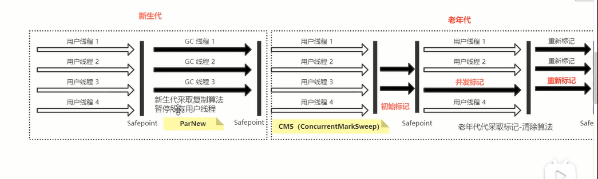

文中截图来自于B站图灵学院诸葛老师的视频课截图


## JVM虚拟机知识点集合

### 1、主要结构

java虚拟机(jvm)是java程序运行必不可少的组件，java程序都需要在jvm上运行。jvm主要包含三个部分，类加载子系统，运行时数据区和字节码执行引擎。


java程序的大致执行过程是：将java文件编译成.class字节码文件，然后将该文件加载到jvm虚拟机中，放入运行时数据区（内存），然后使用字节码执行引擎去执行指令。

## 2、jvm内存结构

jvm内存区主要包括堆，方法区，程序计数器，java虚拟机栈（线程栈）和本地方法栈。下面将分别介绍这几个区域的作用。

### 2.1 java虚拟机栈(线程栈)

java虚拟机栈主要存放java程序在运行过程中的局部方法。为每个方法开辟一个栈区域，这个区域被称为栈桢。注意每个线程都有一个独立的栈内存空间，然后再为每个线程中的局部方法根据执行顺序分配栈桢。如下图所示。


假设有左图所示的代码，则其在jvm中的栈空间大致如右图所示：

<figure class="half">
    
    
</figure>

由于该程序只有一个线程，所以所有方法都存在同一个栈空间中。按照程序执行顺序，首先在栈空间中创建main()方法的栈桢，当运行到compute()方法时再创建一个computer()方法的栈桢。当compute()方法执行结束后出栈，然后继续运行main()方法。

每一个栈桢里面包含局部变量表、操作数栈、动态链接和方法出口。如下图所示。


- 局部变量表： 存放局部方法中的局部变量。
- 操作数栈：  存放程序运行中会使用到的操作数。
- 方法出口：  存放方法结束后应该执行的下一条指令地址。（恢复程序）

下图展示了上面的代码执行时的内存分配情况。执行到`int a=1;`这一行代码时，在操作数栈中存放数据1，在局部变量表中生成局部变量a，然后将操作数栈中的1弹出存入到局部变量a所在的区域。

<figure class="half">
    
    
</figure>

### 2.2 程序计数器

每个线程都有一个独立的程序计数器，这个内存空间存放的是下一条指令的地址。程序计数器可以使方法执行在中断恢复（如执行过程中调用了其他方法等）后仍然可以继续向下执行，而不是从头执行。如下图所示。


程序计数器在每一条指令执行完成后都由字节码执行引擎进行修改。

### 2.2 堆

#### 2.2.1 简介
<font color=red>java程序中基本数据类型直接存在栈中，对象类型的数据在堆中生成，在栈中生成指向该堆空间的引用</font>。如下图所示，在main()方法中有一个Math类变量，在main()方法的虚拟机栈中有一个math变量的<font color=red>引用</font>，指向math在堆中的地址。

堆是线程共享的区域。


#### 2.2.2 堆中内存结构划分

堆内存分为年轻代和老年代，其中年轻代又分为Eden space(伊甸园区，生成区)和 Survior space(幸存区， 两个， s0和s1)。 伊甸园区， s1, s2区之间的比例是8：1：1。


### 2.3 方法区

方法区用于存放常量，静态变量和类信息等。如下图所示，Math类的信息通过类加载子系统经过一系列解析等操作装载到方法区中，Math类中的常量和静态变量也装在方法区中。若静态变量是一个对象，那么<font color=red>在堆中生成该对象，在方法区中生成指向该对象的引用。</font>

jdk1.8之前叫永久代，1.8之后叫元空间。是线程共享的区域。


#### 注：String类型的字符串也是常量。

``` java
String s1="abc";
String s=s1;
String s2=new String("abc")；
```

上面两种方式创建的字符串位于不同位置，s1指向的字符串"abc"位于方法区常量池，是线程共享的，s2指向的字符串位于堆中s。s和s1一样是指向"abc"字符串的引用。故s==s1但s1!= s2.对String 进行内容比较需要用equals()方法。

### 2.4 本地方法区

本地方法区存放的是本地方法,也就是用native修饰的方法，一个Native 方法就是一个java调用非java代码的接口。这种方法一般是用更底层的语言(如c语言)来实现的，是为了java问世后能和其他语言兼容，是对jvm的扩充。

本地方法区是线程独有的。


## JVM垃圾回收算法

可回收垃圾对象：
没有引用指向的对象即是可回收垃圾对象。

### 如何找到垃圾对象
1、 引用计数法:
给对象设置一个计数器，记录对象被引用的次数。当引用失效时，该计数器减一。如果该值为0，说明该对象为垃圾对象。这方法没有用到主流的虚拟机中，因为无法解决对象之间循环引用的问题。例如下图中，堆中的两个对象相互引用，计数器为1，但是栈中没有引用指向这两个对象，这两个对象都是垃圾对象。


2、 可达性分析算法
 根据GC root来判断，以gc root为起点，从这些节点向下搜索引用的对象，搜索到的对象标记为非垃圾对象，未搜索到的对象是垃圾对象，需要进行清理。

GC root根节点：线程栈（java虚拟机栈）的本地变量，静态变量，本地方法栈的变量等等。


### 垃圾回收算法

GC垃圾回收算法是由字节码执行引擎创建的一个专门回收垃圾的线程。大致的过程如下：

新生成的对象首先放到年轻代Eden区，当Eden空间满了，触发Minor GC，存活下来的对象移动到Survivor0区，Survivor0区满后触发执行Minor GC，Survivor0区存活对象移动到Suvivor1区，这样保证了一段时间内总有一个survivor区为空。经过多次Minor GC仍然存活的对象移动到老年代。
老年代存储长期存活的对象，占满时会触发Major GC=Full GC，GC期间会停止所有线程等待GC完成，所以对响应要求高的应用尽量减少发生Major GC，避免响应超时。

<font color=red>（注：移到老年代的机制有很多，还有一些大对象(如超过Survivor区的50%)直接放入老年代中。）</font>

当full gc仍然没有清理掉老年代中的数据，老年代内存空间满之后，就会报OOM错误。

分代年龄：
当一个对象在gc过程中存活下来，则该对象的分代年龄+1。当一个对象的分代年龄达到15，则该对象会被挪到老年代空间中。


分代年龄信息存在每个对象空间中。对象都继承于Object类，Object类的除了实例数据外，还包括对象头。对象头具体空间划分为：


#### 常用垃圾回收算法

##### 1 Mark-Sweep (标记-清除)算法

将内存中标记后的对象直接清除。根据上面的算法查找需要清除的垃圾对象，然后直接将这些对象清除。这种方式会有不连续的空间，形成内存碎片。


##### 2  Copying (复制)算法

复制算法将内存空间分为两份，在需要清除垃圾时，将已使用的内存中的存活对象和未使用空间复制到未使用的那部分内存中，然后清除已使用的内存的所有内容。这种方式不会造成内存碎片，但是比较浪费空间。


##### 3 Mark-Compact (标记整理)算法

这种方法和标记-清除法类似，但是标记-整理法会对存活对象和未使用空间进行排列整理，使得内存空间连续。由于存在整理动作，所以效率较低。


#### 常用垃圾回收器

左边是分代模型，上面是年轻代的垃圾回收器，下面是老年代的垃圾回收器。通常都是上下成对出现。jdk1.0,1.1主要使用的是Serial 这一对垃圾回收器。jdk1.8使用的是PS-PO结合的垃圾回收器。


##### 1 Serial-Serial Old特性

这两种垃圾回收器在GC时都会暂停所有用户线程，然后开启一个GC线程。年轻代使用复制算法来回收垃圾，老年代使用标记-整理算法来回收垃圾。


##### 2 PS-PO算法

这种方式和上面的1一样，只是在gc时，PS-PO会使用多线程来进行GC，效率会更高。


##### 3 CMS 

Serial和PS-PO算法在GC时都会导致STW。为了解决STW时间过长的问题，出现了CMS算法（毫秒级的STW时间），其在垃圾回收时只有很短暂的STW。为了与CMS配对，产生了与PS相似的ParNew算法。年轻代算法如下图。


老年代算法采用标记-清除方法来回收内存。


### JVM调优

JVM调优的目的：
减少GC次数，<font color=red>减少FULL GC发生次数</font>。因为GC发生时会触发STW(stop the world.)。STW会停掉用户的操作（例如网站系统，点击时出现卡顿.）

为什么要有STW这样的设计？不能边GC，用户边操作吗？
答：不行，用户进行操作时会导致对象的状态时刻发生变化，无法完成GC。


## JVM类加载机制

Java程序的运行过程：

1) 编写.java格式的代码，使用javac命令进行编译，将文件编译成.class二进制字节码文件
2) 利用java命令将类加载到JVM中，类的生命周期也开始了。分为加载、连接、初始化三个阶段。连接阶段又分为验证、准备、解析。各个阶段的主要作用如下：

- 加载： 在硬盘上查找，并通过I/O操作将二进制字节流文件读入JVM内存的方法区中。（同时，在JVM的堆中创建Class对象）
- 验证： 验证字节码文件的正确性。
- 准备： 为方法区中的<font color=red>静态变量</font>分配内存空间，并赋予默认初始值。用final static修饰的常量在编译时就已经分配内存空间并赋值了。
- 解析： 将类的符号引用转换为直接引用。（编译阶段JVM并不知道类的地址，所以用一个符号来代替，在解析阶段再将符号引用转换为类似于类的地址的直接引用。）
- 初始化：将类的静态变量设置为指定的初始值，执行静态代码模块。


#### 类加载器底层详细流程


1) 调用底层jvm.dll文件创建JVM实例。 .dll文件是利用C++编写的本地方法。
2) 创建引导类加载器实例（同样是<font color=red>C++实现）</font>
3) 由引导类加载器负责创建JVM启动器实例sun.misc.Launcher，同时创建其他类加载器（扩展类加载器、应用类加载器。）
4) 获取运行类自己的加载器，默认是AppClassLoader。 
5) 调用loadClass()方法进行类加载，然后找到main()方法入口（反射机制）。

#### 双亲委派机制

JDK中主要由三种类加载器：引导类加载器、扩展类加载器和应用类加载器。三者的关系如下图所示。他们的功能分别为：

- 引导类加载器：负责加载jre/lib文件夹下的核心类库，如rt.jar（String类就在这个包种） , charset.jar
- 扩展类加载器：负责加载jre/lib/ext文件夹下的JAR包
- 应用类加载器：加载自己写的类，src文件夹下的类

<font color=red>注意：这三个类之间没有继承关系！！！</font>
他们之间上到下是对方的父加载器，如引导类加载器是扩展类加载器的父加载器。在源代码中通过一个parent属性来表示，所以叫父加载器。

当以上类加载器不满足需求时，还可以编写自定义类加载器（自定义类加载器向上委托到应用类加载器）。通过继承ClassLoader来编写自定义类加载器，里面主要有两个方法，loadClass()和findClass()，loadClass()方法用来实现双亲委派机制。findClass()默认是空，可以自己实现。

双亲委派机制：当类在进行加载的时候，先向上委托父加载器进行加载。如果父加载器加载了，就不需要重复加载。若父加载器没有加载，则需要自己加载。递归这个操作。

##### 为什么要有双亲委派机制？

1) 避免类重复加载
2) 沙箱安全机制：自己定义的java.lang.String类不会被加载，防止核心API库被随意修改。

有了双亲委派机制，在第一次加载类的时候速度比较慢，需要不断向上层询问。但是第一次加载之后，再次需要加载时直接通过应用类加载器进行加载即可，不需要重复之前的操作。


什么情况下需要打破双亲委派机制？如何打破？
答：当一个服务器上有不同版本的代码时，可能需要同时加载不同版本的代码，此时需要打破双亲委派机制。可以通过重写loadClass()方法来打破双亲委派机制。
