文中部分图片来源于b站图灵学院诸葛老师视频课中ppt截图，部分来源于网络

# MySQL知识点整理

## 索引

### 索引是帮助MYSQL高效获取数据的<font color=red>排好序</font>的数据结构

### 实现索引的数据类型有：二叉树，红黑树，Hash表，B-tree

<br>

### 1、 二叉（排序）树
如下图所示，若没有索引，对数据的查找只能遍历，速度慢，且若要查找的数据在表的最后面，则可能需要多次I/O操作，速度很慢。若使用二叉排序树，则可以提高查询效率。例如查询数据89，只需要查询两次即可找到。

<br>

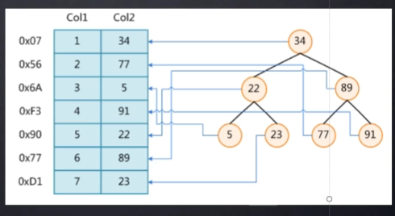

问题：若是按顺序插入数据，如按col1的顺序依次插入1，2，3，4，...，则二叉排序树将变成：

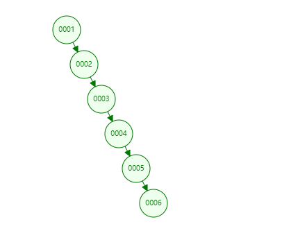

此时，二叉树退化为链表，查询也需要遍历操作。这是由于顺序插入数据时，二叉树的高度太高导致的。于是，就衍生出红黑树（平衡二叉排序树）。

<br>

### 2、 红黑树
红黑树是自平衡二叉树，即其可以通过旋转等操作，使树的两边高度差不超过1。由于二叉排序树的查找效率跟树的高度相关，所以树越低越好。红黑树比普通二叉排序树效率更高。上面的例子将变成以下的图片：

<br>

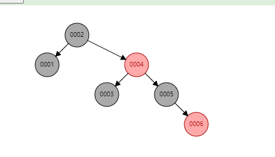

问题：如果数据量有几十万以上，则用红黑树还行吗？

答：红黑树一个节点只有一个索引，对于数据量大的场景，树仍然会很高，查找效率仍然很低。解决的办法是：想办法让树变低。我们可以通过在一个节点中存储多个索引来解决。这就产生了B-Tree.

<br>

### 3、 (1) B-Tree
B-Tree 的结构如下所示，每一个节点存储了多个索引和数据。由于一个节点有多个索引，所以相对于红黑树来说，树的高度更低。在查找到索引后可以直接获得相关的数据。在MySQL中，用于存储索引节点的页大小不能太大，也不能太小。太大的话导致很多数据都会加载到内存中，占用过多内存资源。太小的话，能存储的索引不多，树的高度很高，查询的效率低。在MySQL中页大小一般是16KB.

<br>

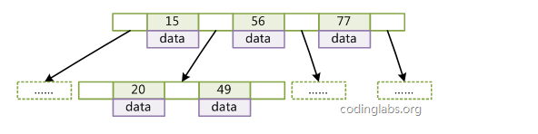

问题：若data本身很大，则树的高度如何？

答：若是data本身数据量不大，则一页可以存较多索引，树的高度低，可以较高效的进行数据查询。但如果data本身很大，比如data大小为1kB，加上存储一个索引节点本身的大小（根据索引类型不同，大小不同，假设索引是BIGINT类型，则是8B），那么一页可以存储的索引个数为（16KB/(1KB+8B)=15.8）,最多存储15个索引。如果总的数据量有几十万，几百万，那么此时树的高度仍然很高。

为了解决上述这种问题，提出了B+ Tree.

### (2) B+ Tree
B+树相比于B树做了优化，每个节点只存储索引，不存储数据。这样一来一页可以存储很多索引，大大降低树的高度，提升查找的效率。所有的数据都存储在叶子节点中，且叶子节点之间有指针，可以方便做范围查找。

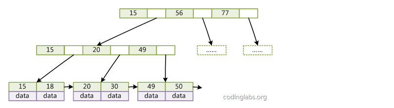

<br>

同样以（1）的例子来看，每个索引大小为8B，索引后面有一个指针指向排好序的下一页的地址，该指针大小一般为6B，所以一页可以存储的索引数量为 (16KB/(8B+6B)=1170.2)，最多可以存储1170个索引。叶子节点中存储的是索引和data, 根据MySQL中存储引擎的不同，其大小不同。假设树的高度为3，data按最大1KB来计算，那么B+树可以存储的数据量为，1170X1170X15. 这已经是千万级的数据量了。在查询时最多进行3次I/O操作。相比于不使用索引的查找，速度简直up up！

大部分情况下，根节点直接存在内存中，可以减少1次I/O操作。有些版本高的数据库将非叶子节点全存到内存中，这样就只需要1次I/O操作就可以实现千万级数据量的查询。

<br>

### (3)总结B-Tree和 B+ Tree的区别。

- B树非叶子节点存储索引和数据，B+树非叶子节点只存储索引，叶子节点才存储索引和数据。B+树的叶子节点中存储了所有索引关键字。B+树的高度更低，查找效率更高。

（注：这里的数据并不一定指数据库表格中的数据，根据存储引擎的不同，可以是数据，也可以是指向数据存储位置的地址）

- B树可以在中间节点查询到数据，B+树只能在叶子节点查询到数据。

- B树每个索引只出现一次，父节点中的索引不会出现在子节点中。B+树的索引可以重复出现。

- B+树的所有叶子节点之间都有指针。


### 4、 利用B+树的存储引擎——InnoDB和MyISAM
先说说MySQL数据库中的表是怎么存储的。如下图所示，最左边是许多数据库实例，每个实例对应一个文件夹（文件夹位置一般默认在mysql安装目录下的data文件夹里面）， 里面存储了该实例下的所有数据库表格。每个数据库表格根据存储引擎的不同有不同的存储形式。下面通过InnoDB和MyISAM两种存储引擎来简单介绍。

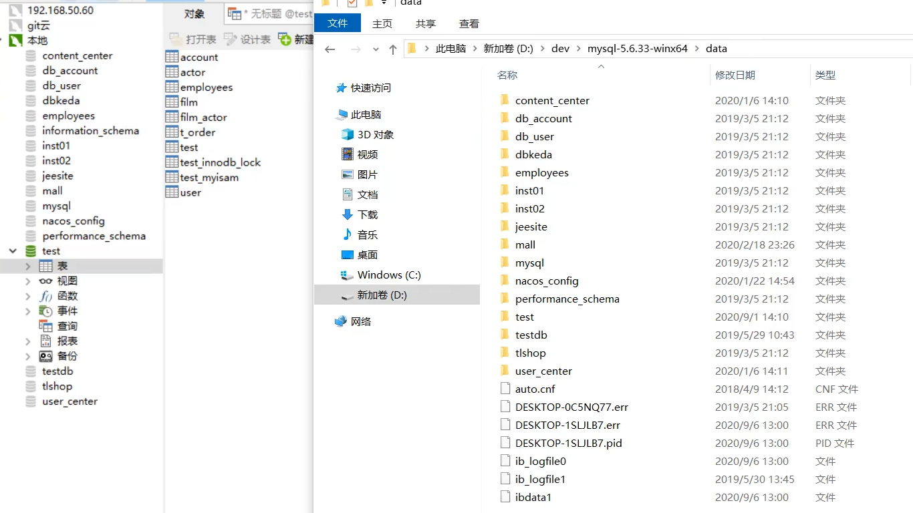

<br>

### (1) MyISAM
在MySQL中， 数据库表在创建时可以选择存储引擎，利用ENGINE关键字即可。如：

```sql
Create table test(
    id int(10) unsigned not null auto_incrememt,
    name char(10),
    age int(4),
    primary key(id))
    ENGINE=MyISAM;
```

这种方式创建的表包含三个文件，.frm文件，.MYD, .MYI文件。三个文件的所用是： 

- .frm文件存储表格的相关信息（格式，字段等）。
- .MYD存储表格中的数据
- .MYI存储表格中的索引。

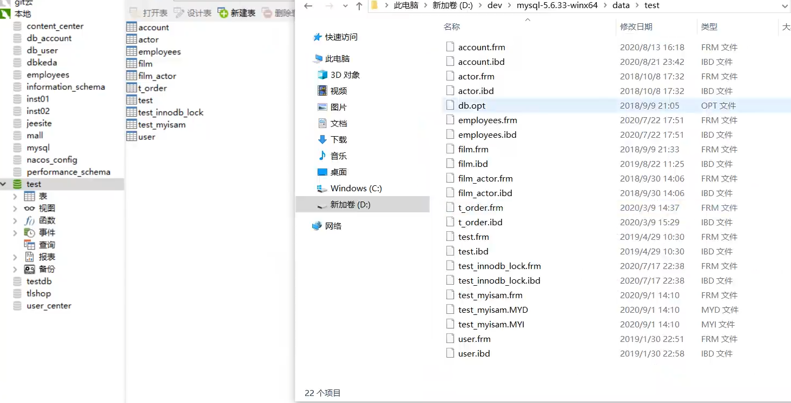

根据这三个文件可以看出,用MyISAM存储的表格数据和索引是分离的，也就是说，在B+树中，叶子节点存储的是索引和索引指向数据行的磁盘文件地址。其查找过程是，通过索引找到相应的数据存放地址，然后通过该地址去获取数据。如下图所示：

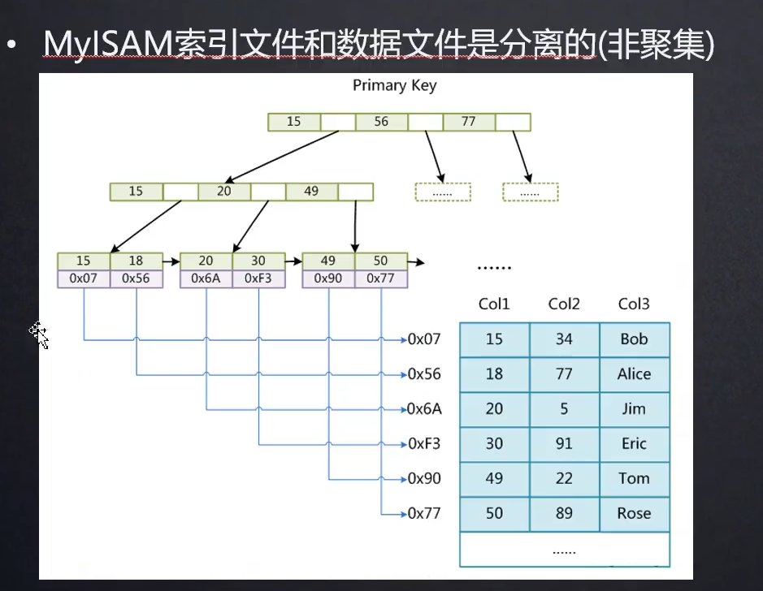

###  (2) InnoDB

创建使用InnoDB存储的表格：

```sql
Create table test(
    id int(10) unsigned not null auto_incrememt,
    name char(10),
    age int(4),
    primary key(id))
    ENGINE=InnoDB;
```

这种方式创建的表包含两个文件， .frm文件和.ibd文件。 .frm文件和的作用MyISAM中一样，用于存储表格相关信息， .ibd文件用于存储数据。所以，在B+树中，叶子节点存储的是索引和索引所在行的数据。其查找过程是，找到索引即可找到数据。如下图所示。

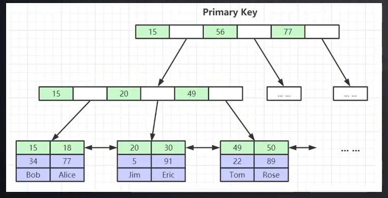

###  (3)  聚集索引和非聚集索引

- 聚集索引：叶节点包含了索引和索引所在行的数据， 如InnoDB索引
- 非聚集索引： 叶节点包含索引和索引所在行磁盘地址， 如MyISAM索引


### (4) InnoDB一些特性
问： 为什么建议InnoDB必须有主键？而且建议使用整型的自增主键？

- 关于主键

对于InnoDB的二级索引来说，其叶子节点存储的不是索引所在行的数据，也不是索引所在行的磁盘地址，而是索引所在行的<font color=red>主键</font>，<font color=red>通过这个主键再去查询相应的数据</font>。所以，InnoDB必须有主键，使用该存储引擎的索引在存储时就已经将数据排序组织成上图的样子了。

若是建表的时候没有定义主键，那么数据库会自动帮你创建一个隐形的，用户不可见的主键，用来组织和存储数据。这会耗费额外的资源，所以使用InnoDB存储引擎必须要有主键。

- 关于主键必须是整型

在选择主键的时候，有些人可能会选择UUID这种格式的来作为主键。UUID在java中使用过，可以生成全球唯一的标识。但是，这种标识是字符串类型的，在通过这种主键排序数据时比较麻烦，没有直接通过整型数据排序简单方便。所以推荐使用整型。

- 关于主键是自增整型主键

若主键不是自增的，可能会出现这种情况：当我已经存储了许多数据（主键不连续,比如1，2，4，5，10，...,30，35，50，....,89, 90, 100），这时新增了一个数据，该数据的主键是一个中间值(比如40)，此时我要把这个主键40的数据插入到这个B+树中，但是，假如（...,30，35，50,...）这部分索引已经占满了一个页，此时再进行插入操作就需要将这一页进行分页操作，这样就需要花大量的精力和资源去维护B+树，所以建议使用<font color=red>自增整型主键</font>。

例如，设置max-degree大小为4，插入了一些数据后，B+树如左图所示，插入数据4后，如右图所示：

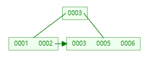  


### (5)  基于Hash表的索引

基于Hash表的索引将需要进行Hash操作的列进行Hash映射，得到一个Hash值，再根据hash值计算出相应的数组下标，然后将数据存到其中。对索引的key进行一次hash运算就可以得到数据存储的位置。很多时候hash索引比B+树要高效，但是hash索引只能对相等，“=”进行查找，不能进行范围查找，B+树可以很方便范围查找。


hash表会出现冲突，解决冲突一般使用链地址法，二次hash法， 线性探查法等。

- 链地址法：如图所示，将定位到同一个下标的数据存在一个链表中。先定位位置，然后顺序遍历链表找到数据。如果链表太大，可以使用红黑树来代替。

- 二次hash法：将冲突的地址在次进行hash映射（不同的hash函数），得到新的下标。

- 线性探查法： 发生冲突后，将数据按下标顺序依次向下寻找到第一个空的地址，用于存放冲突的数据。

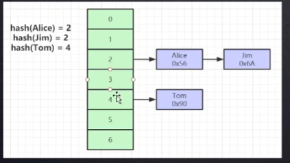

## MySQL基本语法

创建表：

``` SQL
CREATE TABLE stu(
    sid CHAR(6),
    sname CHAR(10),
    grade, INT
);
```

修改表：

``` sql
alter table stu add (gender, CHAR(2));

alter table stu modify sname, CHAR(20);
```

增加记录：

``` sql
insert into stu(sid, sname) VALUES ('sid_2', 'Tom')

insert into stu VALUES ('sid_2', 'Tom', '80', '男')
```

修改记录：

``` sql
update table stu set grade='85' where sid='sid_2' and sname='Tom'
```

删除记录：

``` sql
delete from stu where sid='sid_2' OR grade< 60;
```

#### 1、条件查询

- =, !=, <>, <, <=, >, >=;
- BETWEEN ... AND... ;
- IS NULL;
- AND, OR, NOT;

例子：

``` sql
select * from stu where sid in('sid_1', 'sid_2', 'sid_3');
```

```sql
select * from stu where grade IS NOT NULL;
```

#### 2、模糊查询

- "_"：匹配任意一个字母，有几个下划线就是匹配几个任意字母
- "%"：匹配0-N个字母
使用LIKE关键字

例子：

``` sql
select * from stu where sid LIKE "_i%";        //查找学号第二个字母是i的学生
```

#### 3、字段控制查询

- distinct: 去除重复记录
例子：

```sql
select distinct grade from stu;
```

#### 4、排序

- ASC: 升序
- DEC: 降序

```sql
select * from stu Order By grade ASC;
```

#### 5、 聚合函数

- COUNT(): 统计指定列不为NULL的记录数
- MAX(): 返回指定列的最大值，如果是字符串类型，就用字符串排序
- MIN(): 返回指定列的最小值，如果是字符串类型，就用字符串排序
- SUM(): 计算指定列的数值和，如果不是数值类型，计算结果为0
- AVG(): 计算指定列的平均值，如果不是数值类型，计算结果为0

#### 5、分组查询

- DROUP BY:根据一个或多个列对查询结果进行分组。

```sql
select Avg(grade) from stu group by gender;
```

- HAVING: 过滤声明，在查询返回结果后对结果进行过滤，在having中可以使用聚合函数。HAVING通常和GROUP BY一起使用。
与where的区别：where在结果返回之前起作用，在<font color=red>where中不能使用聚合函数</font>。

```sql
select region, sum(popular), sum(are) 
from bbc
group by region
having sum(popular)>10000;

```

注：使用having不能使用列别名，因为sql语句的执行顺序为：
from-> where-> group by-> having-> select-> distinct-> order by-> limit
同理，where后面也不能使用别名，除非这个别名来自子查询。

- LIMIT 起始行， 结束行： 左开右闭的区间，限制查询范围。

```sql
select * from stu limit 3, 10;  //查询第4到10行的记录
```

- UNION: 合并一个或多个查询结果集，会去除这些结果集中的重复记录
- UNION ALL: 合并一个或多个查询结果集，<font color=red>不去除这些结果集中的重复记录</font>。

例子：

```sql
select * from stu1
UNION
select * from stu2
```

#### 6、连接查询

可以观看https://zhuanlan.zhihu.com/p/68136613内容

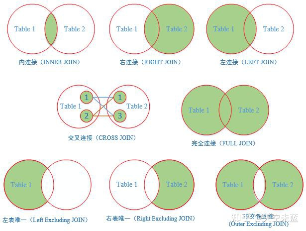